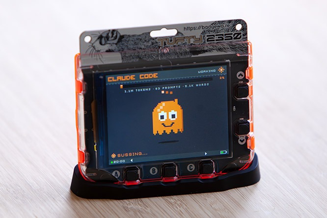
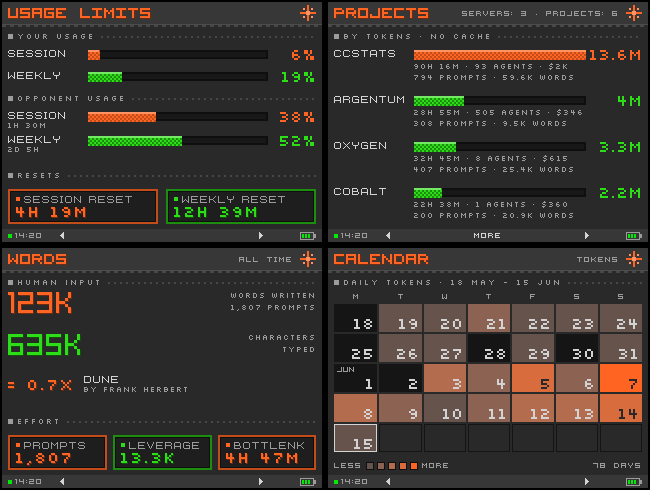
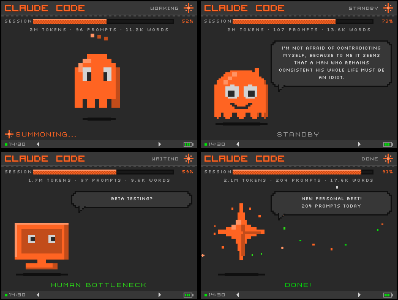
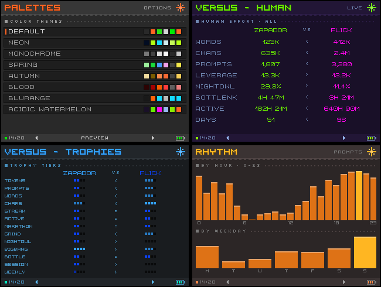
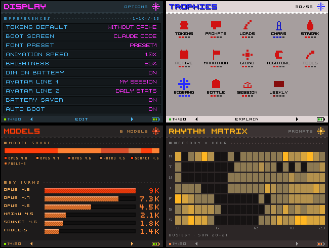

# ccstats

Self-hosted **Claude Code usage stats** — a pipeline that turns a user's Claude Code
sessions into pre-computed JSON feeds and firmware for a **Badgeware Tufty 2350** badge that displays the stats on a 320×240 LCD.
Also a multi-screen web dashboard, that can be used without the hardware device.

The badge does no aggregation: the server computes everything and serves finished JSON over
HTTPS; the badge (or the web dashboard) just draws it. **The server half runs perfectly well on
its own** — if you only want the web dashboard, you don't need a badge.

  
   
  
   
  
   
  
   
  

## How it works

A small badge sits on your desk and shows your Claude Code activity at a glance — a **live avatar
that reacts as you work** (working / idle / waiting), your **session and weekly usage limits** with
countdowns to the next reset, and a rack of stat screens you cycle through with the buttons. That
working / idle / waiting state is read on the server a couple of times a second by watching each
session's live network traffic to the Claude API together with its transcript — there's nothing to
instrument in your editor.

The badge does no number-crunching. Behind it, a **Linux server** runs the pipeline on a cron: it
scrapes your Claude Code session transcripts, computes the stats, and banks them in a durable
**SQLite ledger** — so your totals stay *all-time* even after Claude Code prunes old transcripts. The
finished numbers are served as JSON over token-gated HTTPS, and the badge just draws them.

It can also span **multiple machines** — say a workstation at home and a remote dev server. Each
extra machine ships its own per-session usage to the main server, which folds it into one combined
total, so your stats follow you wherever you run Claude Code.

Among the things it surfaces: your daily/weekly **rhythm** (when you actually work), **token usage**
(with a cache-free input+output lens), **words and characters typed**, prompt counts and streaks,
per-**project** and per-**tool** breakdowns, cost estimates, and optional head-to-head **competition**
against friends running the same pipeline. There are several **color palettes** and display options
(metric toggles, which screens show) to fit personal taste.

You don't need the hardware — the same feeds render in a **web dashboard** in the browser. So the
minimum is just a **Linux machine that runs Claude Code**; the **Badgeware Tufty 2350** badge is an
optional physical desk display on top.

## What's in here

| Path | What it is |
|---|---|
| `server/` | The stats pipeline (parser + all-time SQLite ledger + cost), the optional live/limits/competition monitors, nginx + systemd templates, and `deploy.sh`. Self-contained — set this up alone for a dashboard-only install. |
| `viewscreens/` | The web dashboard `/viewscreens` (HTML5 canvas, PicoGraphics-style). Served by the server; also the **design spec** the firmware is ported from. |
| `firmware/` | The MicroPython badge firmware (PicoGraphics). Fetches the JSON feeds and renders ~21 stat screens + a live avatar. |
| `tools/` | Badge toolchain — `install-app.py`, `enable-autoboot.py`, font builders, and the pre-commit leak scan (`tools/hooks/`). |
| `docs/` | `architecture.md`, `schema.md` (the JSON feed contract), `projects-layout.md` (adapting project discovery to your machine), `remote-fragment.md` (folding in another machine), `device-pitfalls.md`, `useful-notes.md`. |

## Hardware

- **[Badgeware Tufty 2350](https://badgewa.re/)** (RP2350, 320×240 IPS LCD, WiFi, PicoGraphics).
- A USB-C cable for flashing, config and charging. Not included with the Tufty.

## Set up the server

The fastest path: clone the repo on the server, open Claude Code in it, and say
**“read README.md and set it up.”** It investigates the box, generates a token, writes the
config, builds the ledger, and installs the cron + nginx (+ Let's Encrypt). Full playbook,
security notes, and the stats catalog are in **[`server/README.md`](server/README.md)**.
It's also possible to use on a local machine with just the web dashboard, or with a Badgeware Tufty over LAN.

Manual update later: `git pull && sudo ./server/deploy.sh` (code only — your config, token, and
ledger are never touched).

## Set up the badge

Prereq: a working server or local Linux machine (above) with the feed URL + access token.

1. **Flash MicroPython** once: hold BOOTSEL while plugging in → the board mounts as USB storage
   → copy the **Pimoroni Tufty 2350** MicroPython `.uf2` (the Pimoroni build includes
   `picographics`). After this, everything is over USB serial.
2. **Install the app:** `python tools/install-app.py` (needs `mpremote`; be in the `dialout`
   group). Then `python tools/enable-autoboot.py` so the badge launches ccstats on power-on.
3. **WiFi:** double-press RESET to enter USB disk mode and edit `/system/wifi.txt` (one network
   per two lines: SSID, then password; `#` comments; order = priority).
4. **Stats URL + token:** copy `firmware/secrets.example.py` to the device as `/secrets.py` (over
   serial) and fill in your server URL, access token, and display alias.

Or skip the manual steps: clone the repo, connect the badge over USB, open Claude Code here and
say **“read README.md and set up the badge.”**
The repo contain useful documents for Claude to read, so it should be a smooth setup.

## Making changes

- **Firmware:** before you touch fonts, input, drawing, or the installer, read
  **[`docs/device-pitfalls.md`](docs/device-pitfalls.md)**, which collects the hard-won platform
  gotchas (grid-exact fonts, input vs frame cost, the mount bridge, install/launch verification).
- **The web spec** (`viewscreens/`) is the canonical screen design the firmware mirrors — keep
  the two in agreement when changing screens.
- **Practical dev notes** — the firmware ↔ dashboard relationship, verifying a `/viewscreens` change
  with headless Chromium, and the `mpremote` badge dev loop — are in [`docs/useful-notes.md`](docs/useful-notes.md).
- **Hygiene:** enable the pre-commit leak scan once per clone: `git config core.hooksPath tools/hooks`.

## License

Copyright (C) 2026 Zapador <zapador@zapador.net>. Released under the **GNU General Public
License, version 2** — see [`LICENSE`](LICENSE) for the full text. You may use, modify and sell
products built on this code, provided you pass the corresponding source on under the GPLv2 and
keep the notices intact. The bundled fonts are aggregated alongside the code and keep their own
licenses (below); the GPL does not apply to them.

### Font credits

The firmware ships pixel fonts converted to the Alright Fonts (`.af`) format with Pimoroni's
`afinate` (gadgetoid/alright-fonts). Each font keeps the license of its original; full notices
are bundled in `firmware/fonts/` (`OFL.txt` and the per-font readme/license files). Thanks to
their authors:

| Font | Author | License |
|---|---|---|
| [Press Start 2P](https://fonts.google.com/specimen/Press+Start+2P) | CodeMan38 (Cody Boisclair) | [OFL 1.1](https://scripts.sil.org/OFL) |
| [Silkscreen](https://fonts.google.com/specimen/Silkscreen) (Regular + Bold) | The Silkscreen Project Authors | [OFL 1.1](https://scripts.sil.org/OFL) |
| [Deer Diary](https://fontstruct.com/fontstructors/2344499/magicbear) | "MagicBear" (FontStruct) | [OFL 1.1](https://scripts.sil.org/OFL) |
| [Aurora 24](https://www.dafont.com/aurora-24.font) | "badpiggiesglowing" (FontStruct) | [CC BY 3.0](https://creativecommons.org/licenses/by/3.0/) |
| [Visitor TT1](https://www.dafont.com/visitor.font) | Brian Kent ([Ænigma Fonts](http://www.aenigmafonts.com/)) | Freeware (free for personal & commercial use) |
| [3x5](https://www.dafont.com/3x5-mt-pixel.font) / [5x5](https://www.dafont.com/5x5-mt-pixel.font) / [5x7 MT Pixel](https://www.dafont.com/5x7-mt-pixel.font) | MetalTxus (Jesús Miguel Cruz Cana) | dafont "100% Free" |

The `viewscreens/` web dashboard ships an additional pixel-font library (selectable in its preview
picker; not used by any default screen). Each keeps its own license; per-font license/readme files
are bundled under `viewscreens/fonts//` and catalogued in `viewscreens/fonts/CATALOG.md`:

| Font | Author | License |
|---|---|---|
| [Visitor TT2](https://www.dafont.com/visitor.font) | Brian Kent (Ænigma Fonts) | Freeware (personal & commercial) |
| [7 Squared](https://fontstruct.com/fontstructions/show/1507437) | "ajoes" (FontStruct) | [OFL 1.1](https://scripts.sil.org/OFL) |
| [Free Pixel](https://www.dafont.com/free-pixel.font) | levelb | dafont "100% Free" |
| [Org v01](https://www.dafont.com/org-v01.font) | Orgdot | Public domain |
| [Retro Gaming](https://www.dafont.com/retro-gaming.font) | Daymarius | dafont "100% Free" |
| [Thaleah Fat](https://www.dafont.com/thaleahfat.font) | Rick Hoppmann | dafont "100% Free" |
| [Virtual DJ](https://www.dafont.com/virtual-dj.font) | Christian666 | dafont "100% Free" |
| [Hachicro](https://www.dafont.com/hachicro.font) | flucky frog (© 2001) | Freeware (free for personal & commercial use) † |

† Hachicro's readme asks that redistributors contact the author; the author's site
(`venus.dti.ne.jp/~m-ymsk`) and contact are long defunct (404), so it is included here in good faith
with full credit. If you are the author or rights-holder and want it removed, please open an issue.
